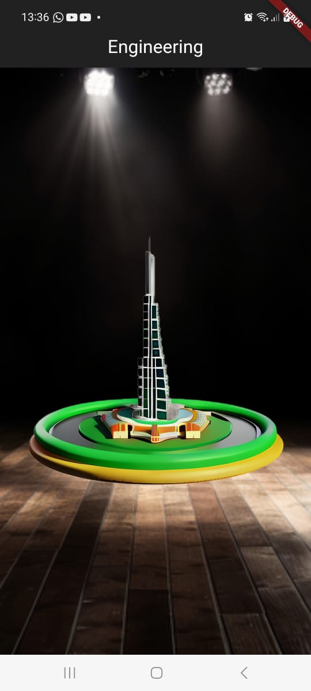

<h1 align="center"> Flutter Project </h1>

Flutter Project.

  <a href="#-tecnologies">Tecnologies</a>&nbsp;&nbsp;&nbsp;|&nbsp;&nbsp;&nbsp;
  <a href="#-project">Project</a>&nbsp;&nbsp;&nbsp;|&nbsp;&nbsp;&nbsp;
  <a href="#-diagram">Diagram</a>&nbsp;&nbsp;&nbsp;|&nbsp;&nbsp;&nbsp;
  <a href="#memo-license">License</a>

  

 

  

## 🚀 Tecnologies

This project was developed with the following technologies:

- Flutter
- Dart
- Git and Github
- Android Studio
- Diagram.net (draw.io)

## 💻 Project

"Im Software Developer" is a simple application that displays just a header with a centered title and an image in the center of the application.
It was created with the aim of showing the use of Widgets that make up the basic structure of an application created in Flutter/Dart such as MaterialApp and Scafoold.

## 🔖 Project Diagram

  

You can view the project Diagram through [THIS LINK](https://app.diagrams.net/#HJoaniceGaspar%2Fiam_rich%2Fmain%2FI%20am%20rich#%7B%22pageId%22%3A%22A2E0x7AI6BWVsamxQEBP%22%7D).

